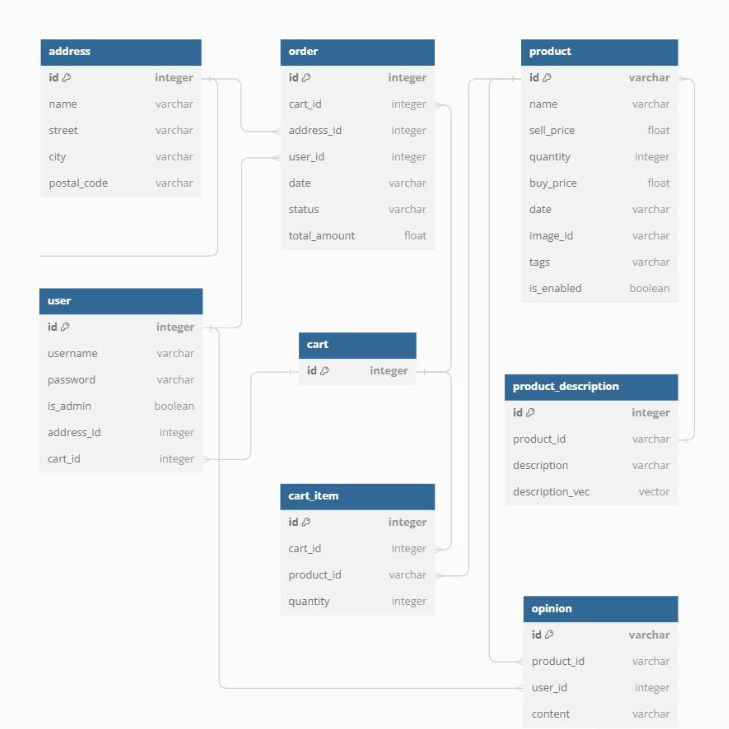

# Advanced databases
### by Bartosz Bartoszewski, Łukasz Faruga, Adam Filapek, Kacper Jarzyna

## Implementation of a management, administration, and sales panel for an e-commerce store supported by a chatbot
## Table of Contents
  
  - [Installation](#installation)
  - [Usage](#usage)
  - [Important informations](#Important_informations)
  - [About](#about)
  - [Features](#features)
## Installation

For running aplication *Docker* is required.

1. Clone the repository:

    ```bash
    git clone https://github.com/AiR-ISZ-Gr1/systemy_rozproszone.git
    ```

2. Setup infrastructure:

    If on UNIX based system run:
    ```bash
    . start_compose.sh
    ```
    To shut down the aplication you should:
    ```bash
    . stop_compose.sh
    ```

   
    If on Windows open Docker Desktop as admin and Windows PowerShell as admin and run:
    ```bash
    ./start.bat
    ```
    To shut down the aplication you should:
    ```bash
    ./stop_compose.bat
    ```
  5. Wait till container `databases-startup` goes down.

  6. Everything is set up.

## Important informations
The Chatbot application is not working locally because it is based on the ChatGPT API. To run this, you need to add the API according to the instructions below:
1. Create .env file in `app/processes/chatbot`
2. In .env file create enviromental variable called OPENAI_API_KEY, and assign to it your [openai api key](https://openai.com/index/openai-api/)

Example file is provided `.env.example`.


## Usage

1. Open `localhost:8501` in your website
2. Log-in to test client `TestU` or test admin `TestA`, the password for both accounts is: !234qwert

## About
This project is a modern web application for an e-commerce flower shop, based on a microservices architecture. The aim of the project is to enable users to purchase various flower arrangements through a website, offering a wide range of products such as bouquets, potted plants, wreaths, and occasional arrangements. A key element of the application is the integrated chatbot, which acts as a virtual assistant, helping users choose products, providing advice and answers to questions about orders, and offering personalized recommendations using artificial intelligence algorithms.

## Features

- **User Interface (Frontend)**

Customer: Allows users to browse products, place orders, track transactions, and manage their profiles.
Admin: Provides access to advanced application management features, such as user management, product data editing, order processing, statistics analysis, and report generation.

- **Controllers**

Customer Panel Controller: Manages customer interactions, allowing profile viewing and editing, product recommendations, cart modifications, and purchase transactions.
Admin Panel Controller: Manages administrator interactions, allowing user, product, and order management.

- **Processes**

Product Recommendation: A recommendation system based on the analysis of order history and the user's current cart. The chatbot can also suggest products based on reviews and product descriptions.
Add Opinion: A module that allows adding reviews of purchased products and verifying whether a particular product was purchased by the user.
Order Products: A module that accepts customer orders, checks product availability, and processes orders while updating inventory.

- **Services**

Order Status Change: Allows administrators to update order statuses in response to various events.
User Authentication: The authentication process verifies the identity of users and assigns appropriate permissions.
Product Search: A tool for effectively finding products based on defined criteria.
LLM Services: Utilize advanced AI algorithms to interpret, analyze, and generate responses to natural language queries.

- **Databases**

Manages and manipulates data across various databases, supporting requests related to product descriptions, customer reviews, user data, orders, and inventory statuses.

In project were used 3 types of databases:

- PostgreSQL: Stores information about users, carts, and addresses. It is one of the most popular open-source SQL databases, known for its scalability, performance, and security features, making it ideal for storing sensitive information.
- MongoDB: Stores information about products and opinions. It is one of the most popular open-source NoSQL databases, known for its dynamic schema, flexibility, scalability, and performance.
- Qdrant: Stores information about product descriptions. Designed specifically for storing, managing, and searching vector representations of data, such as feature vectors used in artificial intelligence, natural language processing (NLP), recommendation systems, and other machine learning applications. We use the intfloat/e5-small-v2 model for vectorization.





Address
- id (integer, primary key): Unique identifier for the address.
- name (varchar): Name associated with the address.
- street (varchar): Street.
- city (varchar): City.
- postal_code (varchar): Postal code.

User
- id (integer, primary key): Unique identifier for the user.
- username (varchar): Username.
- password (varchar): Password for the user account.
- is_admin (boolean): Indicates if the user has admin privileges.
- address_id (integer, foreign key): References the address table, indicating the user's address.
- cart_id (integer, foreign key): References the cart table, indicating the user's current cart.

Order
- id (integer, primary key): Unique identifier for the order.
- cart_id (integer, foreign key): References the cart table, linking the order with a specific cart.
- address_id (integer, foreign key): References the address table, indicating the delivery address for the order.
- user_id (integer, foreign key): References the user table, indicating who placed the order.
- date (varchar): Date the order was placed.
- status (varchar): Current status of the order (e.g., pending, shipped, delivered).
- total_amount (float): Total amount of the order.

Product
- id (varchar, primary key): Unique identifier for the product.
- name (varchar): Product name.
- sell_price (float): Selling price of the product.
- quantity (integer): Available quantity of the product in stock.
- buy_price (float): Purchase price of the product.
- date (varchar): Date the product was added.
- image_id (varchar): Image identifier for the product.
- tags (text): Tags associated with the product, used for categorization.
- is_enabled (boolean): Indicates if the product is available for sale.

Cart
- id (integer, primary key): Unique identifier for the cart.

Cart Item
- id (integer, primary key): Unique identifier for the cart item.
- cart_id (integer, foreign key): References the cart table, linking the item to a specific cart.
- product_id (varchar, foreign key): References the product table, indicating which product is in the cart.
- quantity (integer): Quantity of the product in the cart.

Opinion

- id (varchar, primary key): Unique identifier for the opinion.
- product_id (varchar, foreign key): References the product table, indicating which product the opinion is about.
- user_id (integer, foreign key): References the user table, indicating who gave the opinion.
- content (varchar): Content of the user's opinion.

Vectorized Description
- id (integer, primary key): Unique identifier for the vector.
- product_id (varchar, foreign key): References the product table, indicating which product the vector is about.
- description (varchar): Description of the product.
- vectorized_description (vector): Result of the vectorization of the description.

Relationships
- Each user can have multiple addresses, and each address can be associated with multiple users.
- Each user is linked to one cart, and each cart can contain multiple cart items.
- Each cart item is associated with one product.
- Each order is linked to one cart, one address, and one user.
- Each opinion is associated with one product and one user.
- Each product is associated with one description.

- **Architecture**

The project is based on a microservices architecture, ensuring flexibility and scalability. Each functionality of the store, such as the product catalog, payment system, or user management, is handled by a separate microservice. This allows for easy introduction of new features and scaling of the system as needed. Each microservice operates in an isolated Docker container, ensuring a consistent runtime environment and ease of deployment.
Technologies


